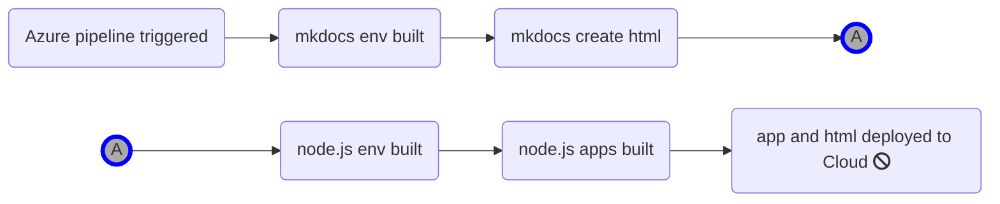

# Mermaid

Mermaid 'a simple markdown-like script language for generating charts from text via javascript' [mermaidjs.github.io](https://mermaidjs.github.io/).

<http://bwmarrin.github.io/MkDocsPlus/mermaid/>

## Examples of Mermaid Graph



The above chart is rendered from the following code using the ```` ```mermaid````   code fence

```code
graph LR
  A(Azure pipeline triggered)
  B(mkdocs env built)
  C(mkdocs create html)
  
  C1((A))
  C2((A))
  
  D(node.js env built)
  E(node.js apps built)
  F(app and html deployed to Cloud fa:fa-ban)

  A-->B
  B-->C
  C-->C1
  C2-->D
  D-->E
  E-->F

  style C1 fill:#AAA,stroke:#00F,stroke-width:4px
  style C2 fill:#AAA,stroke:#00F,stroke-width:4px
```

!!! Note
    Why use this?
    Creating flowcharts and block diagrams to illustrate a process is to be encouraged whether imbedding an image or generating the content inline.
    Mermaid has the advantage of embedding the diagram in the source - document as code.
    For some use cases a process could generate mermaid code to automate any updates in the documentation.

!!! bug
    31.05.2019 Does not get rendered in the pdf version

Ref: <https://github.com/Python-Markdown/markdown/blob/master/docs/extensions/admonition.md>
